# Processo Seletivo QA

## Sobre o projeto

Este projeto foi desenvolvido como parte de um processo seletivo para a área de Quality Assurance (QA), contemplando atividades de testes manuais, testes de API e automação de testes.

O objetivo foi realizar a análise de uma aplicação web, elaborar e executar cenários de testes, identificar e documentar comportamentos inesperados, realizar testes em uma API pública e automatizar um cenário funcional utilizando Cypress.

---

# 1. Testes Manuais

## Objetivo

Realizar testes funcionais, exploratórios e visuais na aplicação SauceDemo, buscando validar os principais fluxos da aplicação e identificar possíveis comportamentos inesperados.

Foram elaborados e executados 8 cenários de teste, contemplando funcionalidades de login, compra, carrinho, checkout, ordenação e finalização de pedidos.

---

## Casos de teste

### CT01 – Login com usuário válido

| Campo | Informação |
|---|---|
| **Cenário** | Login com credenciais válidas |
| **Usuário** | `Standard_user` |
| **Passos** | Dado que estou na página de Login da SauceDemo<br>**E** Possuo as credenciais válidas<br>**Quando** informo as credenciais e clico em Login<br>**Então** devo ser direcionado para a tela de produtos |
| **Resultado esperado** | Usuário autenticado e direcionado para página dos produtos |
| **Resultado obtido** | Usuário foi autenticado e direcionado corretamente para a página de produtos |
| **Status** | Passou. |

---

### CT02 – Login com usuário bloqueado

| Campo | Informação |
|---|---|
| **Cenário** | Tentativa de Login com usuário bloqueado |
| **Usuário** | `locked_out_user` |
| **Passos** | Dado que estou na página de Login da SauceDemo<br>**E** utilizo o usuário `locked_out_user` com a senha `secret_sauce`<br>**Quando** tento realizar o Login<br>**Então** o sistema deve impedir o acesso a aplicação |
| **Resultado esperado** | O acesso deve ser impedido e o usuario deve ser avisado que seu acesso está bloqueado. |
| **Resultado obtido** | O acesso a aplicação foi impedido. |
| **Status** | Passou. |

---

### CT03 – Realização de compra com usuário padrão

| Campo | Informação |
|---|---|
| **Cenário** | Realização de compra completa |
| **Usuário** | `Standard_user` |
| **Passos** | Dado que estou dentro da aplicação com o usuário `standard_user`<br>**E** existe um determinado produto disponível para compra<br>**Quando** adiciono o produto ao carrinho, acesso o checkout, preencho os dados obrigatórios e finalizo a compra<br>**Então** o sistema deve concluir o pedido e apresentar a confirmação da compra |
| **Resultado esperado** | Compra concluída com sucesso e confirmação de finalização apresentada. |
| **Resultado obtido** | O processo de compra foi concluído sem erros e a confirmação de finalização foi apresentada. |
| **Status** | Passou. |

---

### CT04 – Adição de produtos ao carrinho

| Campo | Informação |
|---|---|
| **Cenário** | Adição de produtos ao carrinho |
| **Usuário** | `problem_user` |
| **Passos** | Dado que estou autenticado como `problem_user` e na página de produtos<br>**E** existem diferentes produtos disponíveis para adição ao carrinho<br>**Quando** tento adicionar diferentes produtos ao carrinho<br>**Então** todos os produtos disponíveis devem permitir a adição |
| **Resultado esperado** | Todos os produtos devem poder ser adicionados ao carrinho. |
| **Resultado obtido** | Nem todos os produtos puderam ser adicionados, sendo possível selecionar apenas alguns produtos. |
| **Status** | Falhou. |

---

### CT05 – Correspondência das imagens do produto

| Campo | Informação |
|---|---|
| **Cenário** | Validar correspondência entre imagem e produto |
| **Usuário** | `problem_user` |
| **Passos** | Dado que estou autenticado como `problem_user` e na página de produtos<br>**E** os produtos possuem nome, descrição e imagem correspondente<br>**Quando** comparo as imagens apresentadas com as informações dos respectivos produtos<br>**Então** cada produto deve apresentar uma imagem correspondente à sua descrição |
| **Resultado esperado** | As imagens devem corresponder as respectivas descrições dos produtos. |
| **Resultado obtido** | As imagens apresentadas eram iguais e não correspondiam as descrições dos produtos. |
| **Status** | Falhou. |

---

### CT06 – Ordenação dos produtos

| Campo | Informação |
|---|---|
| **Cenário** | Alterar ordenação dos produtos |
| **Usuário** | `Problem_user` |
| **Passos** | Dado que estou autenticado e na página de produtos<br>**E** o site tem várias opções de ordenação dos produtos<br>**Quando** tento alterar a ordenação apresentada<br>**Então** o site deve reorganizar os produtos de acordo com a ordenação escolhida |
| **Resultado esperado** | O site deve reorganizar as imagens de acordo com a ordenação escolhida. |
| **Resultado obtido** | As ordenações não puderam ser selecionadas/alteradas. |
| **Status** | Falhou. |

---

### CT07 – Preenchimento dos dados de checkout

| Campo | Informação |
|---|---|
| **Cenário** | Preenchimento dos dados obrigatórios de checkout |
| **Usuário** | `Problem_user` |
| **Passos** | Dado que estou autenticado e na tela de checkout<br>**E** os campos de informações estão disponíveis para serem preenchidos<br>**Quando** tento preencher o campo "Last name"<br>**Então** o campo deve aceitar a informação e prosseguir normalmente com a compra |
| **Resultado esperado** | O campo "Last name" aceitar a informação de preenchimento |
| **Resultado obtido** | O campo "Last name" não aceita informações de preenchimento e direciona o preenchimento novamente para o campo "First Name" |
| **Status** | Falhou. |

---

### CT08 – Finalização de compra

| Campo | Informação |
|---|---|
| **Cenário** | Finalização de compra |
| **Usuário** | `error_user` |
| **Passos** | Dado que estou autenticado e avancei até a etapa final do checkout<br>**E** os dados da compra foram preenchidos e o sistema permitiu avançar para a etapa de pagamento<br>**Quando** clico no botão "finish"<br>**Então** o sistema deve finalizar o pedido e apresentar a confirmação de compra. |
| **Resultado esperado** | O pedido deve ser finalizado e uma mensagem de confirmação deve ser mostrada. |
| **Resultado obtido** | O botão "finish" não executou nenhuma ação ao ser clicado. |
| **Status** | Falhou. |

---

## Resumo dos testes manuais

| ID | Cenário | Status |
|---|---|---|
| CT01 | Login com usuário válido | ✅ Passou |
| CT02 | Login com usuário bloqueado | ✅ Passou |
| CT03 | Realização de compra com usuário padrão | ✅ Passou |
| CT04 | Adição de produtos ao carrinho | ❌ Falhou |
| CT05 | Correspondência das imagens do produto | ❌ Falhou |
| CT06 | Ordenação dos produtos | ❌ Falhou |
| CT07 | Preenchimento dos dados de checkout | ❌ Falhou |
| CT08 | Finalização de compra | ❌ Falhou |

**Total:** 8 cenários executados  
**Passaram:** 3  
**Falharam:** 5

---

# 2. Bugs encontrados

Durante a execução dos testes manuais, foram identificados **12 bugs** na aplicação.

---

## BUG 001 – Certos produtos não podem ser adicionados ao carrinho com o usuário `problem_user`

### Como reproduzir

1. Acessar o site SauceDemo.
2. Realizar o login com usuário `problem_user` e senha `secret_sauce`.
3. Acessar a página de produtos.
4. Tentar adicionar individualmente os 6 produtos disponíveis ao carrinho.
5. Verificar o comportamento apresentado ao tentar adicionar cada produto.

### Resultado esperado

Todos os 6 produtos devem ser adicionados normalmente ao carrinho.

### Resultado obtido

Apenas três dos seis produtos puderam ser adicionados ao carrinho: **Sauce Labs Backpack, Sauce Labs Bike Light e Sauce Labs Onesie**.

Os produtos **Sauce Labs Bolt T-Shirt, Sauce Labs Fleece Jacket e Test.allTheThings() T-Shirt (Red)** não puderam ser adicionados ao carrinho.

### Evidência

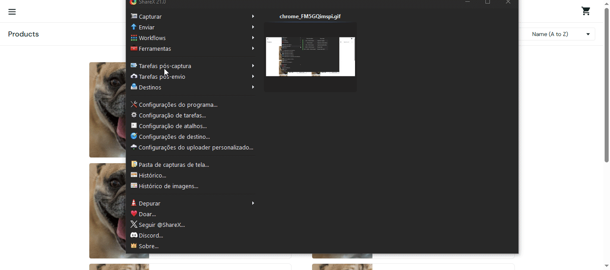

---

## BUG 002 – Todos os produtos da lista apresentam uma imagem padrão que não corresponde ao produto, com o usuário `problem_user`

### Como reproduzir

1. Acessar o site SauceDemo.
2. Realizar o login com usuário `problem_user` e senha `secret_sauce`.
3. Acessar a página de produtos.

### Resultado esperado

Cada produto deve apresentar uma imagem correspondente ao respectivo produto e às informações exibidas na página.

### Resultado obtido

Todos os seis produtos apresentados na página exibem a mesma imagem de um cachorro, independentemente do nome e das informações correspondentes a cada produto.

### Evidência

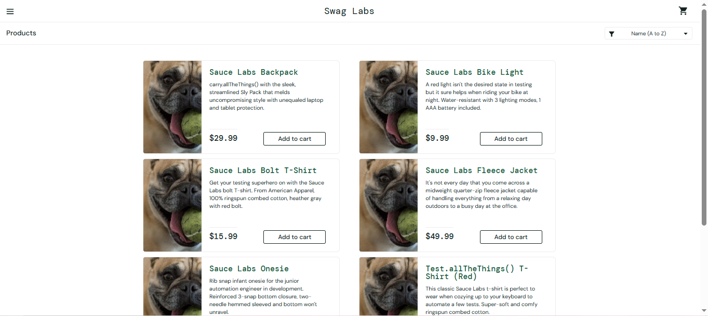

---

## BUG 003 – Produto apresentado na tela de detalhe não corresponde ao produto selecionado com o usuário `problem_user`

### Como reproduzir

1. Acessar o site SauceDemo.
2. Realizar o login com usuário `problem_user` e senha `secret_sauce`.
3. Acessar a página de produtos.
4. Selecionar um produto na listagem.
5. Comparar o nome do produto selecionado com o produto apresentado na tela de detalhes.
6. Repetir o processo com os outros produtos.

### Resultado esperado

Ao selecionar um produto, a tela de detalhes deve apresentar o mesmo produto da tela inicial.

### Resultado obtido

Os produtos apresentados na tela de detalhes não correspondem aos produtos selecionados na página de produtos.

### Evidência

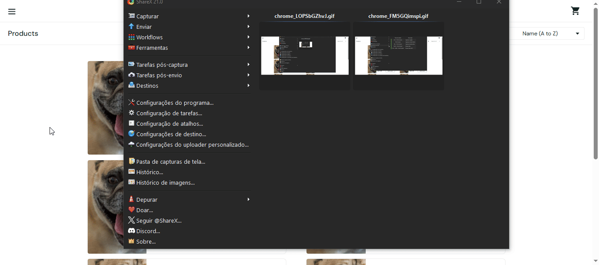

---

## BUG 004 – Não é possível alterar a ordenação dos produtos com o usuário `problem_user`

### Como reproduzir

1. Acessar o site SauceDemo.
2. Realizar o login com usuário `problem_user` e senha `secret_sauce`.
3. Acessar a página de produtos.
4. Acessar o campo de ordenação dos produtos.
5. Tentar selecionar as opções de ordenação **A to Z, Z to A, Price (low to high) e Price (high to low)**.

### Resultado esperado

As opções de ordenação devem poder ser selecionadas e consequentemente os produtos se reorganizarem de acordo com a ordenação que foi escolhida.

### Resultado obtido

A opção de ordenação não pode ser alterada.

### Evidência

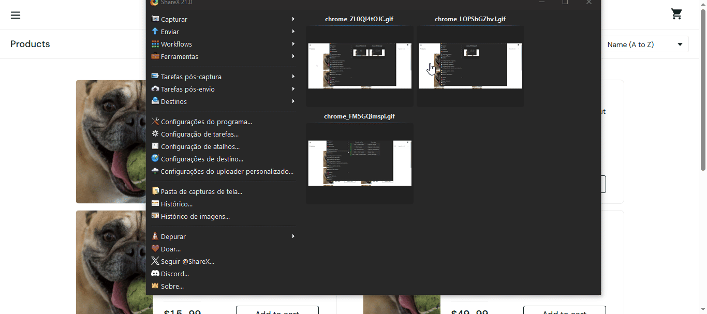

---

## BUG 005 – Campo `Last name` não aceita preenchimento na hora do checkout com o usuário `problem_user`

### Como reproduzir

1. Acessar o site SauceDemo.
2. Realizar o login com usuário `problem_user` e senha `secret_sauce`.
3. Acessar a página de produtos.
4. Adicionar um produto ao carrinho.
5. Acessar o carrinho e prosseguir para o checkout.
6. Preencher o campo `First name`.
7. Tentar preencher o campo `Last name`.

### Resultado esperado

O campo `Last name` deve aceitar normalmente as informações inseridas, permitindo o preenchimento completo dos dados obrigatórios e o prosseguimento do processo de compra.

### Resultado obtido

O campo `Last name` não aceita as informações inseridas. Ao tentar realizar o preenchimento das informações em tal campo, automaticamente é apagado o que está em `First name` e o que está sendo escrito em `Last name` fica sendo replicado letra por letra no campo `First name`, impossibilitando o prosseguimento normal do processo de compra.

### Evidência

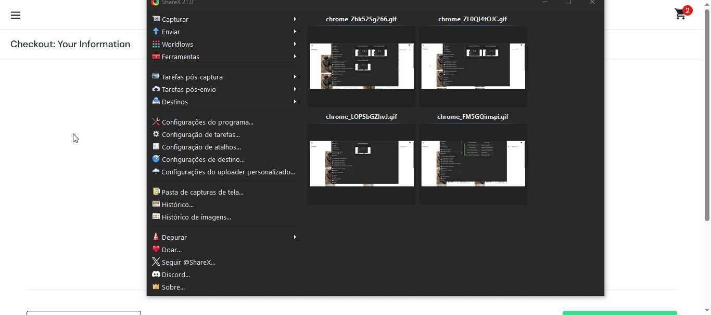

---

## BUG 006 – Lentidão de aproximadamente 5 segundos em diferentes ações com o usuário `performance_glitch_user`

### Como reproduzir

1. Acessar o site SauceDemo.
2. Realizar o login com usuário `performance_glitch_user` e senha `secret_sauce`.
3. Acessar a página de produtos.
4. Acessar um produto e retornar para a página principal de produtos.
5. Acessar o carrinho e retornar para a página principal de produtos.
6. Alterar a ordenação dos produtos e selecionar outra opção de ordenação.
7. Acessar o processo de checkout e retornar para a página principal de produtos.

### Resultado esperado

As transições entre as diferentes telas e a alteração da ordenação dos produtos devem ocorrer de forma adequada, sem apresentar uma demora significativa para o usuário.

### Resultado obtido

Foi identificada uma demora de aproximadamente 5 segundos nas seguintes ações:

- Retorno da tela de detalhes do produto para a página principal de produtos;
- Retorno da tela do carrinho para a página principal de produtos;
- Alteração da ordenação dos produtos;
- Retorno da tela de finalização da compra para a página principal de produtos.

---

## BUG 007 – Erro apresentado ao tentar alterar a ordenação de exibição dos produtos com o usuário `error_user`

### Como reproduzir

1. Acessar o site SauceDemo.
2. Realizar o login com usuário `error_user` e senha `secret_sauce`.
3. Acessar a página de produtos.
4. Acessar o campo de ordenação.
5. Tentar selecionar as opções **Z to A, Price (high to low) e Price (low to high)**.

### Resultado esperado

O sistema deve permitir a seleção das opções de ordenação e reorganizar os produtos de acordo com a opção escolhida.

### Resultado obtido

Ao tentar selecionar as opções **Z to A, Price (high to low) e Price (low to high)**, o sistema apresenta a mensagem:

> "Sorting is broken! This error has been reported to Backtrace."

### Evidência

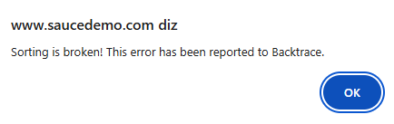

---

## BUG 008 – Campo `Last name` não aceita preenchimento com o usuário `error_user`

### Como reproduzir

1. Acessar o site SauceDemo.
2. Realizar o login com usuário `error_user` e senha `secret_sauce`.
3. Acessar a página de produtos.
4. Adicionar um produto ao carrinho.
5. Acessar o carrinho e prosseguir para checkout.
6. Preencher o campo `First name`.
7. Tentar preencher o campo `Last name`.

### Resultado esperado

O campo `Last name` deve permitir a inserção dos dados necessários para finalização do checkout.

### Resultado obtido

O campo `Last name` não aceita a inserção dos dados, impossibilitando assim seu preenchimento.

### Evidência

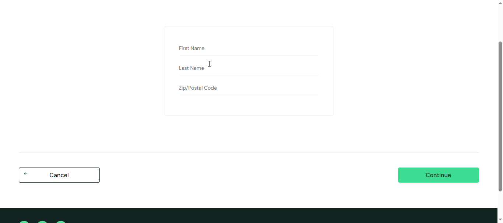

---

## BUG 009 – Sistema permite avançar no checkout sem preencher o campo obrigatório `Last name`, no usuário `error_user`

### Como reproduzir

1. Acessar o site SauceDemo.
2. Realizar o login com usuário `error_user` e senha `secret_sauce`.
3. Acessar a página de produtos.
4. Adicionar um produto ao carrinho.
5. Acessar o carrinho e prosseguir para checkout.
6. Preencher o campo `First name`.
7. Preencher o campo `Zip/Postal Code`.
8. Clicar em `Continue`.

### Resultado esperado

O sistema deve impedir o avanço para a próxima etapa e mostrar uma mensagem de erro informando para ser preenchido o campo obrigatório `Last name`.

### Resultado obtido

Mesmo com o campo `Last name` sem ser preenchido, o sistema permite o avanço para a tela de pagamento.

### Evidência

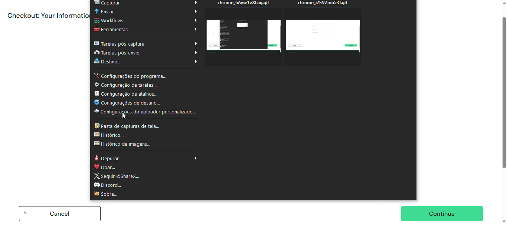

---

## BUG 010 – Botão `Finish` não executa nenhuma ação no ato de finalização da compra, com o usuário `error_user`

### Como reproduzir

1. Acessar o site SauceDemo.
2. Realizar o login com usuário `error_user` e senha `secret_sauce`.
3. Acessar a página de produtos.
4. Adicionar um produto ao carrinho.
5. Acessar o carrinho e prosseguir para checkout.
6. Preencher o campo `First name`.
7. Preencher o campo `Zip/Postal Code`.
8. Clicar em `Continue`.
9. Clicar em `Finish`.

### Resultado esperado

O sistema deve informar uma mensagem de confirmação e finalizar a compra.

### Resultado obtido

Ao clicar no botão `Finish`, nenhuma ação é executada e o pedido não é finalizado.

### Evidência

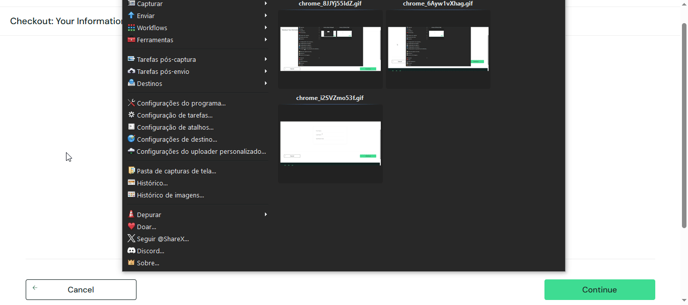

---

## BUG 011 – Elementos da interface apresentam desalinhamento visual em diferentes telas, no usuário `visual_user`

### Como reproduzir

1. Acessar o site SauceDemo.
2. Realizar o login com usuário `visual_user` e senha `secret_sauce`.
3. Acessar a página de produtos.
4. Observar o posicionamento dos elementos do menu e do carrinho.
5. Acessar o carrinho e observar novamente o posicionamento dos elementos.
6. Prosseguir para a tela de informações do checkout e verificar o posicionamento dos elementos da interface.

### Resultado esperado

Os elementos da interface devem permanecer corretamente posicionados e alinhados em todas as telas da aplicação, mantendo um padrão visual consistente.

### Resultado obtido

Foram identificados desalinhamentos visuais em diferentes elementos da interface. Na página de produtos, os três traços do menu apresentam inclinação e o ícone do carrinho encontra-se fora do posicionamento esperado. No carrinho, além desses elementos, o botão **Checkout** também apresenta desalinhamento. Na tela de informações do checkout, os elementos do menu e do carrinho permanecem fora do posicionamento esperado.

### Evidências

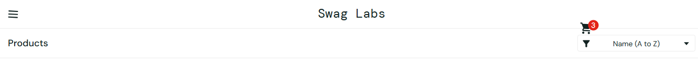

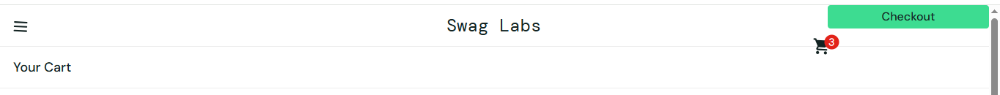

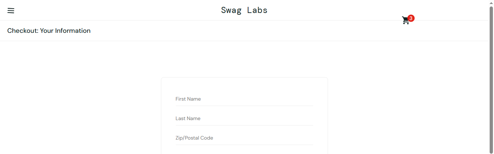

---

## BUG 012 – Produto apresenta imagem incorreta na tela de listagem, com o usuário `visual_user`

### Como reproduzir

1. Acessar o site SauceDemo.
2. Realizar o login com usuário `visual_user` e senha `secret_sauce`.
3. Acessar a página de produtos.
4. Localizar o primeiro produto da lista.
5. Comparar a imagem apresentada na listagem com a imagem apresentada na tela de detalhes do produto.

### Resultado esperado

O produto deve apresentar, na tela de listagem, a mesma imagem correspondente ao produto que é apresentada em sua tela de detalhes.

### Resultado obtido

Na tela de listagem de produtos, o primeiro produto apresenta a imagem de um cachorro, que não corresponde ao produto apresentado. Ao acessar a tela de detalhes do produto, a imagem correta é exibida.

### Evidências

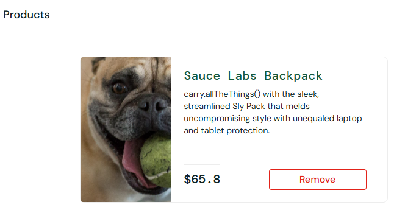

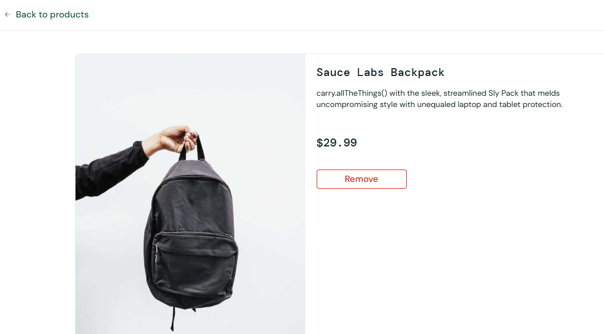

---

## Resumo dos bugs

Foram identificados **12 bugs** durante os testes manuais, envolvendo:

- funcionalidades do carrinho;
- imagens e informações dos produtos;
- ordenação;
- preenchimento do checkout;
- validação de campos obrigatórios;
- finalização de compra;
- desempenho;
- aspectos visuais da interface.

A documentação original dos bugs também está disponível no arquivo `Bugs.docx`.

---

# 3. Testes de API

## API utilizada

**Restful Booker**

Os testes foram realizados utilizando o Postman em uma API pública disponibilizada para estudo e testes.

---

## Endpoint 01 – Listar reservas

**Método:** `GET`

**Endpoint:**

`https://restful-booker.herokuapp.com/booking`

### Objetivo

Consultar a lista de reservas disponíveis na API.

### Verificações realizadas

- Verificar se o status retornado corresponde ao que consta na documentação da API.
- Verificar se a estrutura/formato da resposta corresponde ao que consta na documentação da API.
- Verificar se não existe erro ou algum tipo de resposta inesperada.
- Verificar o tempo de resposta da requisição.

### Resultado esperado

De acordo com a documentação da API, o endpoint `GET /booking` deve conter uma lista com os IDs das reservas disponíveis.

### Resultado obtido

A API retornou status `200`, mostrando em formato JSON uma lista de `bookingid`, confirmando o comportamento apresentado na documentação.

### Evidência

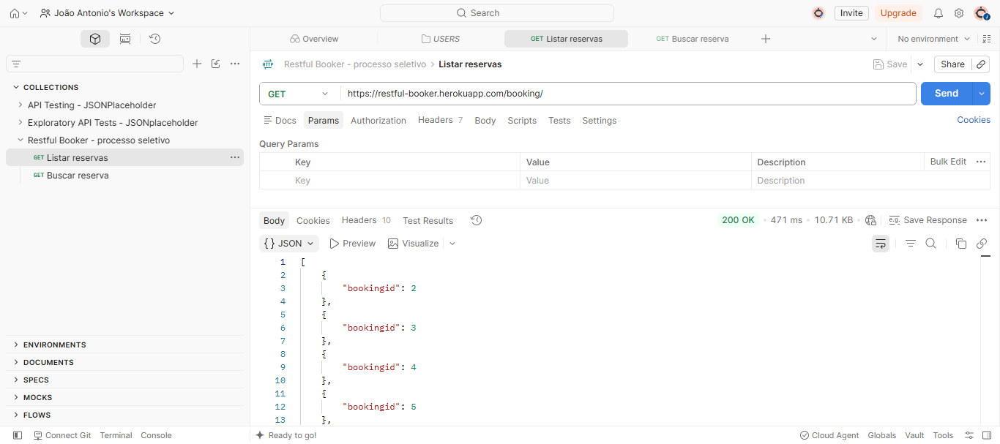

---

## Endpoint 02 – Consultar uma reserva específica

**Método:** `GET`

**Endpoint:**

`https://restful-booker.herokuapp.com/booking/2`

### Objetivo

Consultar os dados de uma reserva específica utilizando seu ID.

### Verificações realizadas

- Verificar se o status retornado corresponde ao esperado.
- Verificar se a resposta contém os dados da reserva consultada.
- Verificar se a estrutura da resposta está de acordo com a documentação.
- Verificar se não existe erro ou resposta inesperada.
- Verificar o tempo de resposta.

### Resultado esperado

A API deve retornar os dados correspondentes à reserva associada ao ID informado.

### Resultado obtido

A API retornou status `200` e apresentou os dados da reserva em formato JSON, contendo informações como nome, sobrenome, valor total, status do depósito, datas de entrada e saída e necessidades adicionais.

### Evidência

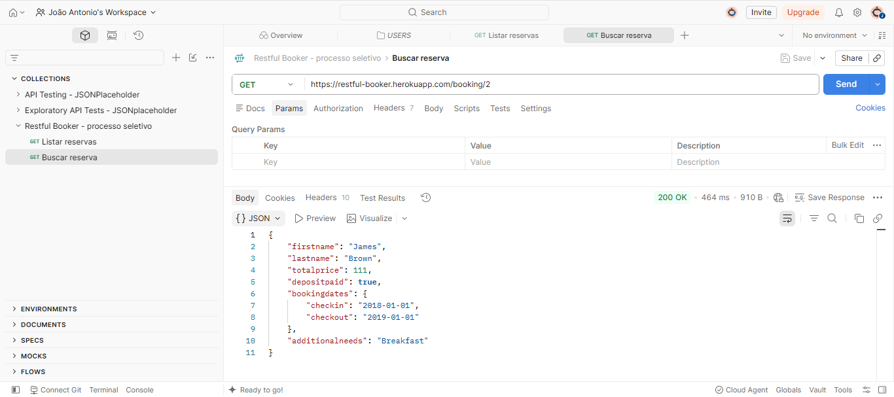

---

## Resultado dos testes de API

As duas requisições realizadas apresentaram respostas compatíveis com o comportamento esperado:

| Endpoint | Método | Status | Resultado |
|---|---|---|---|
| `/booking` | GET | 200 | ✅ Passou |
| `/booking/2` | GET | 200 | ✅ Passou |

A documentação completa da análise realizada no Postman também está disponível no arquivo `Analise-API - Restful Booker.docx`.

---

# 4. Automação de testes

## Objetivo

Automatizar um cenário funcional da aplicação SauceDemo utilizando Cypress.

Como o projeto possui apenas um cenário automatizado, foi utilizada uma estrutura simples, mantendo o código diretamente no arquivo de teste, sem implementação de Page Object Model.

---

## Ferramentas utilizadas

- **Cypress**
- **JavaScript**
- **Node.js**

---

## Cenário automatizado

### Login com usuário válido

**Usuário:** `standard_user`

**Senha:** `secret_sauce`

### Fluxo automatizado

1. Acessar a página de login da SauceDemo.
2. Informar o usuário.
3. Informar a senha.
4. Clicar no botão de Login.
5. Validar o direcionamento para a página de produtos.
6. Validar a presença do título `Products`.

### Código utilizado

```javascript
/// <reference types = "cypress" />

describe('Login', () => {

  it('Deve realizar login com sucesso', () => {

    cy.visit('https://www.saucedemo.com/')

    cy.get('#user-name')
      .type('standard_user')

    cy.get('#password')
      .type('secret_sauce')

    cy.get('#login-button')
      .click()

    cy.url()
      .should('include', '/inventory.html')

    cy.get('.title')
      .should('contain', 'Products')
      .and('be.visible')

  })

})
```

### Validações automatizadas

Foram implementadas duas validações:

**1. URL da página**

A aplicação deve direcionar o usuário para:

`/inventory.html`

**2. Título da página**

O texto `Products` deve estar presente e visível na página.

### Resultado

O cenário foi executado com sucesso e as validações foram aprovadas.

### Evidência da execução

A execução do teste apresentou o cenário como aprovado no Cypress, com as duas validações concluídas com sucesso.

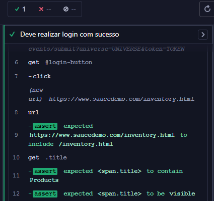

---

## Como executar a automação

### 1. Acessar a pasta da automação

```bash
cd automacao-saucedemo-cypress
```

### 2. Instalar as dependências

```bash
npm install
```

### 3. Abrir o Cypress

```bash
npx cypress open
```

### 4. Selecionar

No Cypress:

`E2E Testing` → `login.cy.js`

---

# 5. Estrutura do projeto

```text
processo-seletivo-qa
│
├── README.md
│
├── automacao-saucedemo-cypress
│   ├── cypress
│   │   ├── e2e
│   │   │   └── login.cy.js
│   │   ├── fixtures
│   │   └── support
│   │       ├── commands.js
│   │       └── e2e.js
│   │
│   ├── cypress.config.js
│   ├── package.json
│   └── package-lock.json
│
├── evidencias
│   ├── automacao-login.PNG
│   ├── API-001-listar-reservas.PNG
│   ├── API-002-consulta-reserva.PNG
│   ├── bug-001.gif
│   ├── bug-002.PNG
│   ├── bug-003.gif
│   ├── bug-004.gif
│   ├── bug-005.gif
│   ├── bug-007.PNG
│   ├── bug-008.gif
│   ├── bug-009.gif
│   ├── bug-010.gif
│   ├── bug-011.PNG
│   ├── bug-011-01.PNG
│   ├── bug-011-02.PNG
│   ├── bug-012.PNG
│   └── bug-012-01.PNG
│
├── Bugs.docx
├── Analise-API - Restful Booker.docx
└── casos-de-testes-manuais.xlsx
```

---

# 6. Tecnologias e ferramentas

- **Testes manuais:** análise funcional, exploratória e visual
- **Documentação:** Microsoft Word e Excel
- **Testes de API:** Postman
- **API:** Restful Booker
- **Automação:** Cypress
- **Linguagem:** JavaScript
- **Versionamento:** Git e GitHub

---

# 7. Documentação complementar

Os documentos utilizados durante o desenvolvimento do projeto também estão disponíveis no repositório:

- **Bugs:** documentação completa dos 12 bugs identificados.
- **Análise de API – Restful Booker:** documentação dos testes realizados no Postman.
- **Casos de testes manuais:** planilha contendo os cenários de teste executados.

---

# 8. Situação de análise

### Cenário

Ao finalizar uma compra, o sistema apresenta uma mensagem de erro, mas aparentemente o pedido foi criado.

### Como eu investigaria

Primeiramente, tentaria reproduzir o problema para confirmar o comportamento.

Em seguida, verificaria se o pedido realmente foi criado, comparando as informações da compra, como produto, valor e status.

Também analisaria o comportamento apresentado pela aplicação e, caso disponíveis, verificaria logs ou outras informações que possam ajudar a identificar a causa.

Após confirmar a inconsistência, documentaria os passos para reprodução, o resultado esperado, o resultado obtido e as evidências, encaminhando o problema para o time responsável.

---

## Considerações finais

O projeto contemplou diferentes áreas de atuação em QA, desde a elaboração e execução de testes manuais até a identificação e documentação de bugs, testes de API e automação de um cenário funcional.

A proposta foi demonstrar a aplicação prática de conceitos de qualidade, análise de comportamento da aplicação, documentação de resultados e automação de testes.
